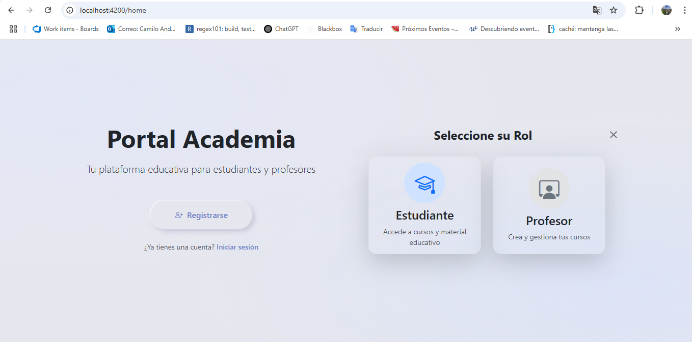
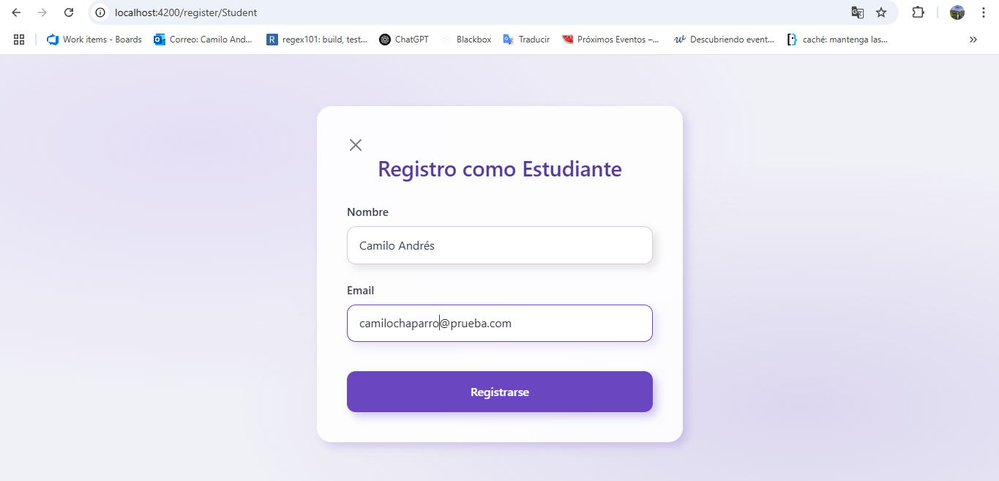
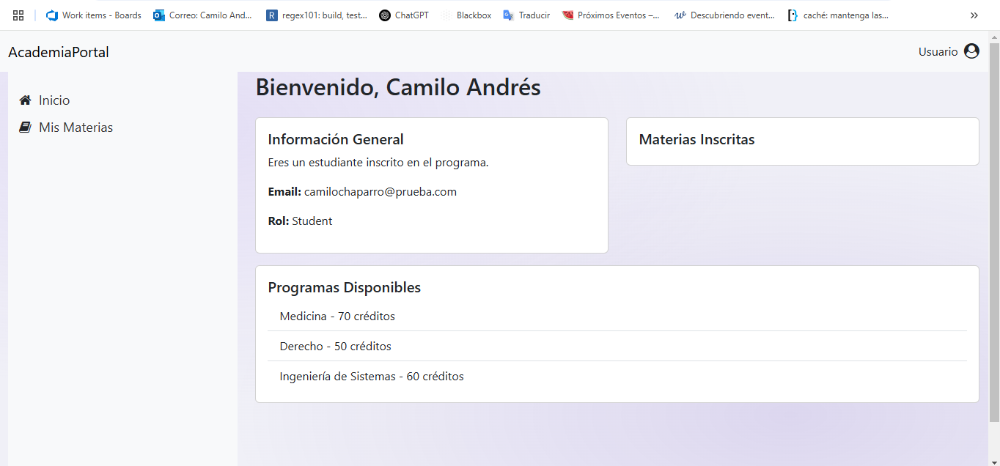

# Academia Portal Frontend

Este Proyecto fue generado por [Angular CLI](https://github.com/angular/angular-cli) version 19.2.0.

Camilo Chaparro - Desarrollador de Software

## 🚀 Descripción
AcademiaPortalFrontend es una aplicación web desarrollada en **Angular** que permite a estudiantes y profesores gestionar su información académica de manera sencilla e intuitiva.

Este proyecto está diseñado para consumir una API en **.NET 8**, permitiendo la gestión de usuarios, materias y programas de estudio.

---

## Arquitectura
El frontend sigue una arquitectura modular con **standalone components** y utiliza Angular Router para la navegación.

 **Módulos Principales:**  
- **`home`** → Página de inicio con el registro de usuario.  
- **`auth`** → Registro de usuarios y autenticación.  
- **`dashboard`** → Panel principal con la información del usuario.  

**Componentes Compartidos:**  
- **Navbar** → Barra de navegación con opciones de usuario.  
- **Sidebar** → Menú lateral con opciones de navegación.  
- **ModalRole** → Modal para seleccionar el rol en el registro.  

**Servicios:**  
- **`api.service.ts`** → Manejo de peticiones HTTP al backend.  

---

## 🛠️ Tecnologías Utilizadas
- **Angular 19** (Framework frontend)
- **Bootstrap 5** (Diseño responsive)
- **FontAwesome** (Íconos)
- **RxJS** (Manejo de datos reactivos)
- **Angular Router** (Navegación entre vistas)
- **HttpClient** (Consumo de APIs en .NET 8)

---

## ⚙️ Prerrequisitos
Antes de ejecutar el proyecto, asegúrate de tener instalados:
- [Node.js 18+](https://nodejs.org/)
- [Angular CLI 19](https://angular.io/cli)
- [Git](https://git-scm.com/downloads)

---

## Paso a Paso para Ejecutar el Proyecto

### **1️⃣ Clonar el Repositorio**
```bash
git clone https://github.com/tu-usuario/AcademiaPortalFrontend.git
cd AcademiaPortalFrontend
```

### **2️⃣ Instalar Dependencias**
```bash
npm install
```
Esto instalará todas las dependencias necesarias.

### **3️⃣ Configurar la Conexión con el Backend**
Asegúrate de que el backend está corriendo en **http://localhost:5000**.
Si es necesario, edita `src/app/services/api.service.ts`:
```typescript
private baseUrl = 'http://localhost:5000/api';
```

### **4️⃣ Ejecutar la Aplicación**
```bash
ng serve --open
```
Esto iniciará el servidor de desarrollo en `http://localhost:4200`.

---


## 📌 Notas Adicionales
- Para detener el servidor, usa:
```bash
CTRL + C
```
- Si hay errores con las dependencias, intenta:
```bash
npm cache clean --force
npm install
```

---


## 🔍 Previsualización

<div style="text-align: center;">
  
  <br>
  
  <br>
  
  <br>
  
</div>


